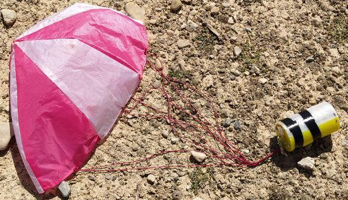
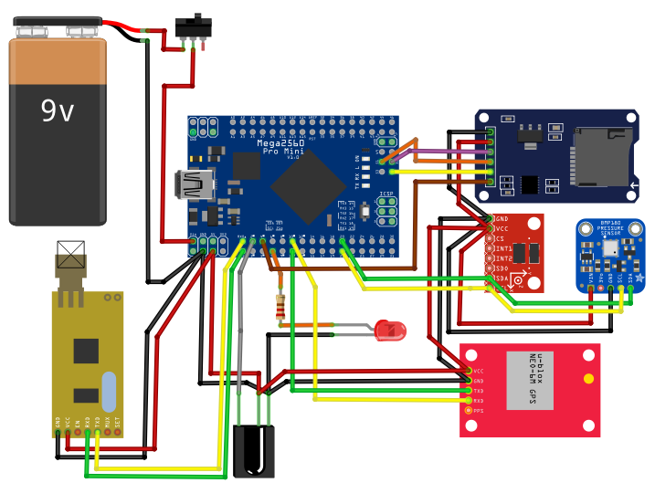
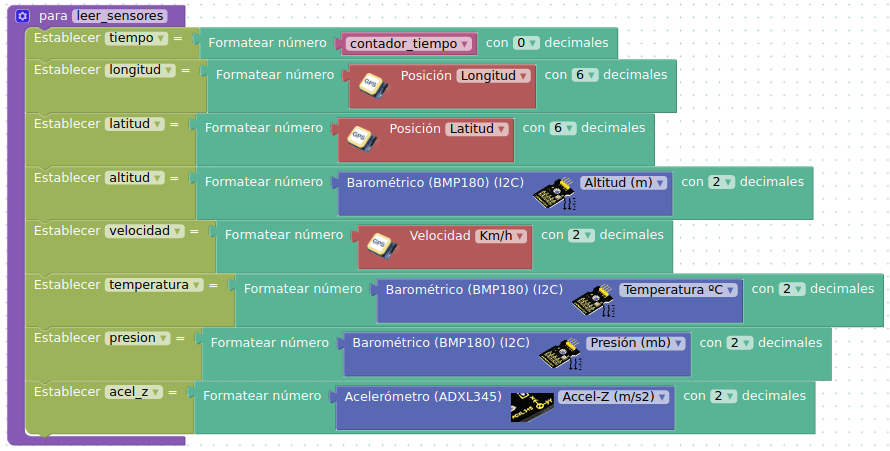
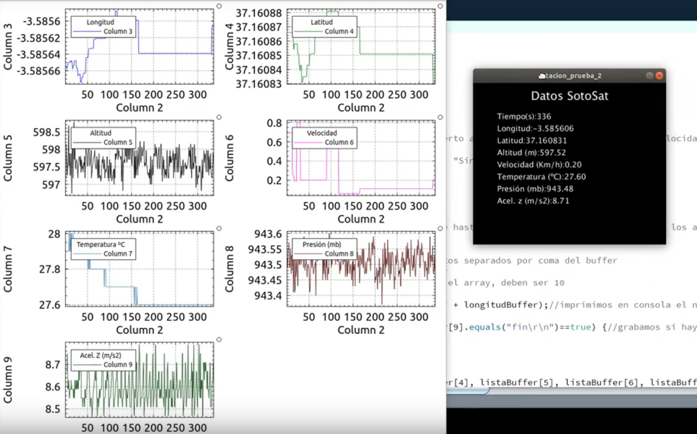

# Introducción

* El proyecto **Cansat Educativo** es un sistema electrónico programable para telemetría de datos atmosféricos y geolocalización, lanzado por un cohete y rescatado con un paracaídas.

CanSat

*  El **sistema electrónico programable** con el lenguaje visual Arduinoblock es un Arduino Mega 2560 Pro Mini con los siguientes sensores: BMP180, acelerómetro, receptor IR y GPS. También un datalogger en memoria microSD para la grabación de datos en local y el módulo de comunicaciones RF APC220 para mandar los datos captados por los sensores a la estación base.

Esquema de conexiones

Programa Sensores

* La **estación base** recibe los datos por radio y  con el lenguaje de programación Processing almacena los datos en un archivo de datos plano y visualiza gráficamente, en tiempo real, la recepción de los datos con la aplicación KST.

Presentación y gráficas de los datos

