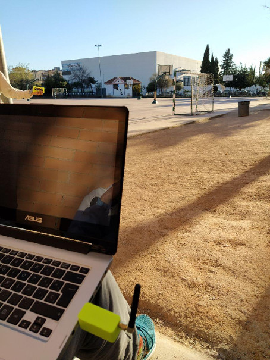
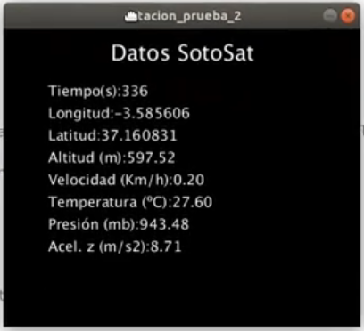

# Programa de Estación Base (PC) en Processing.
El programa de la **Estación Base** se ejecuta en el PC, establece comunicación con el puerto serie (APC200 receptor pinchado en USB), filtra los posibles datos erróneos que provengan de cansat usando tres comprobaciones: verifica que la cantidad de campos que hay en cada registro sean 10, verifica que el primer y el último campo tengan un valor determinado, en nuestro caso primer campo “soto” y el último campo “fin”. Más tarde con los datos ya filtrados los guarda en un fichero y los muestra en consola y ventana.
<center>


Estación Base
</center>

A continuación el [código processing](https://drive.google.com/file/d/1h5Gw03SzC58vAIHrscAUBQ4DusNBqbN4/view) de la **Estación Base**, esperamos que los comentarios sean suficientemente aclaratorios. 

```arduino
import processing.serial.*;

Serial puerto;	        //establece variable puerto tipo Serial
PrintWriter fichero;	//establece variable fichero tipo PrintWriter (fichero)
int contador=0;	        //variable para contar el nº de grabaciones realizadas

void setup() {
  //Descomentar la siguiente linea para ver el puerto asignado
  //println(Serial.list());
  size (400, 335);
  background(0);
 //establece la variable puerto asignando el receptor APC200 y
 // una velocidad de 9600 baudios (se modifica para optimizar)
  puerto = new Serial(this, Serial.list()[32], 9600);
  fichero=createWriter("datos.csv");	//crea el fichero datos.csv
  datosPantalla("Sin datos", "Sin datos", "Sin datos", "Sin datos", "Sin datos", "Sin datos", "Sin datos", "Sin datos");
}

void draw() {

  datosPantalla("Sin datos", "Sin datos", "Sin datos", "Sin datos", "Sin datos", "Sin datos", "Sin datos", "Sin datos");

  //mientras haya datos en el puerto serie
  while (puerto.available()>0) {
    //leemos los datos del puerto serie hasta el salto de línea (10 en ascii), 
    //y los asignamos a buffer
	String buffer=puerto.readStringUntil(10);

    //si buffer no está vacío
	if (buffer!=null) {                         
  	String[] listaBuffer = split(buffer, ',');	//extrae en un array los elementos separados por coma del buffer
  	int longitudBuffer=buffer.length();	        //leemos el nº de caracteres del buffer
  	int numeroCampos=listaBuffer.length;	    //leemos el nº de campos que están en el array, deben ser 10
  	//println (buffer);
    //imprimimos en consola el nº de campos y nº de caracteres recibidos
  	println ("el nº de campos es:" + numeroCampos + " el nº de caracteres es:" + longitudBuffer);
                 
    //grabamos si hay 10 campos y los campos de control de inicio y fin son correctos
  	if (numeroCampos==10 && listaBuffer[0].equals("soto")==true && listaBuffer[9].equals("fin\r\n")==true) {
    	contador++;
    	fichero.print(buffer);	//colocamos en el fichero el buffer
    	fichero.flush();	    //hacemos la grabación efectiva y se cierra el fichero
    	println(buffer);	    //imprimimos por consola lo grabado
        //llamamos a la función que nos pone en pantalla los datos recogidos
    	datosPantalla(listaBuffer[1], listaBuffer[2], listaBuffer[3], listaBuffer[4], listaBuffer[5], listaBuffer[6], listaBuffer[7], listaBuffer[8]);
  	} else {
    	datosPantalla("Sin datos", "Sin datos", "Sin datos", "Sin datos", "Sin datos", "Sin datos", "Sin datos", "Sin datos");
  	}
	}
  }
}

void datosPantalla(String tiempo, String longitud, String latitud, String altitud, String velocidad, String temperatura, String presion, String acelz) {
  background(0);
  textSize (24);
  text ("Datos SotoSat", 120, 35);
  textSize(16);
  text ("Tiempo(s):"+ tiempo, 50, 75);
  text ("Longitud:"+longitud, 50, 100);
  text ("Latitud:"+latitud, 50, 125);
  text ("Altitud (m):"+altitud, 50, 150);
  //text ("Rumbo:"+rumbo, 50, 175);
  text ("Velocidad (Km/h):"+velocidad, 50, 175);
  text ("Temperatura (ºC):"+temperatura, 50, 200);
  text ("Presión (mb):"+presion, 50, 225);
  text ("Acel. z (m/s2):"+acelz, 50, 250);
  //text ("Día:"+dia, 50, 100);
  //text ("Hora:"+hora, 50, 125);
}
```
El resultado es el siguiente:
<center>


Presentación de los datos. Estación Base
</center>